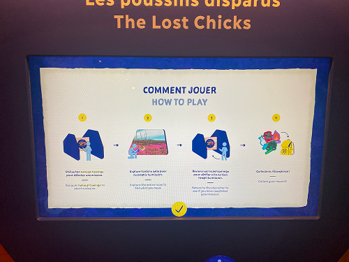

# Nanualuk – Expédition Nordique

## Informations générales sur l'exposition
Il s'agit d'une exposition permanante, en intérieure, présentée au Centres des sciences de Montréal et que j'ai visitée le 1er avril 2026.  

>Affiche de l'exposition

>Moi, Théana Leurot et Thomas Bozelko devant l'entrée de l'exposition

## Les poussins disparus
### Nom de la firme, année de réalisation  

>Vue d'ensemble du dispositif

>Vue rapprochée du dispositif

## Description du dispositif

>Explications de l'exposition
Explications blah blah la photo est invisible

>A et B : Mise en contexte du dispositif

Ici, notre mission est de

>C : Affichage lorsqu'il manque des poussins

>D : Affichage lorsque tous les poussins sont trouvés

## Type d'installation
Il s'agit d'une installation intéractive

## Fonction du dispositif

## Mise en espace

## Composantes et techniques

## Éléments nécessaires à la mise en exposition

## Expérience vécue

## Ce qui m'a plus

## Ce qui m'a moins plus

## Références
[Site de l'exposition](https://www.centredessciencesdemontreal.com/exposition-permanente/nanualuk-expedition-nordique) 

