# Nanualuk – Expédition Nordique

## Informations générales sur l'exposition
Il s'agit d'une exposition permanente, en intérieure, présentée au Centres des sciences de Montréal et que j'ai visitée le 1er avril 2026.  

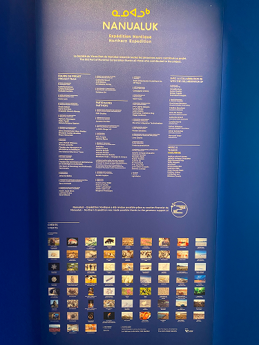
>Affiche de l'exposition

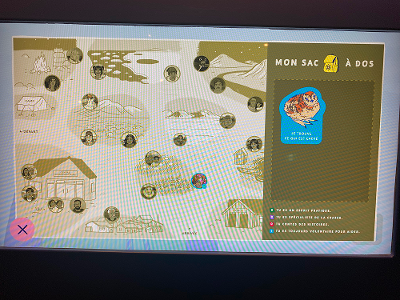
>Carte de l'exposition

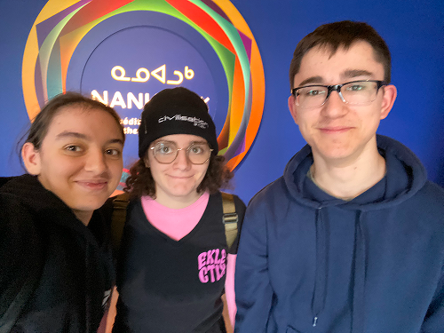
>Moi, Théana Leurot et Thomas Bozelko devant l'entrée de l'exposition

## Les poussins disparus
### GSM Studios, 2025

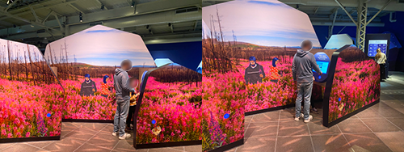
>Vue d'ensemble du dispositif

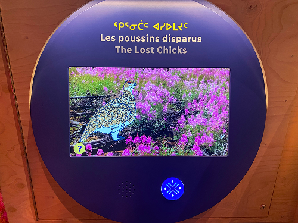
>Vue rapprochée du dispositif

## Description du dispositif

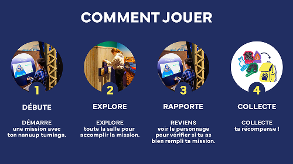
>Explications de l'exposition (photo prise sur le site de l'exposition, voir les [références](#références))

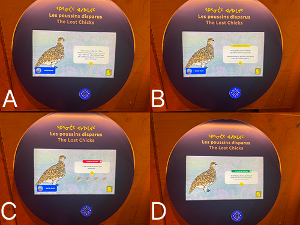
>A et B : Mise en contexte du dispositif

Ici, notre mission est de retrouvés les 4 poussins perdus qui sont cachés dans la salle et de les rapporter.

>C : Affichage lorsqu'il manque des poussins

>D : Affichage lorsque tous les poussins sont trouvés

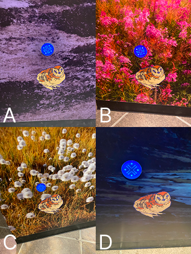
>Les poussins à retrouver.

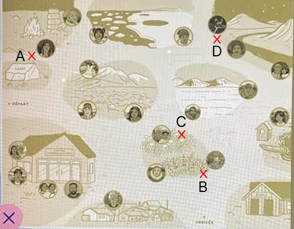
>La location de chaque poussin sur la carte

## Type d'installation
Il s'agit d'une installation intéractive

## Fonction du dispositif
Ce dispositif à pour but le support pédagogique, puisqu'il transmet des connaisances et apprentissages sur l'oiseau présent dans ce dispositif, c'est à dire un Tétras à queue fine.

## Mise en espace

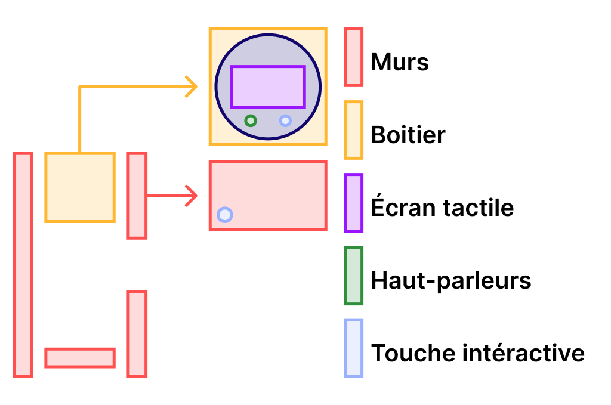
>Croquis du dispositif dans l'espace

## Composantes et techniques  

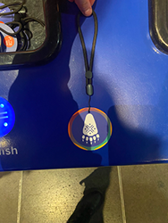
>Le badge qui permet d'intéragir avec les dispositifs. Il est appelé un "Nanuup Tuminga".

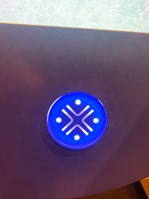
>Ce type de rond est présent partout dans l'exposition, il suffit de déposer notre Nanuup Tuminga dessus pour soit intéragir avec un dispositif ou récolter quelque chose dans la salle. Dans le cas de ce dispositif, il est utilisé pour ramasser les poussins qui sont dispersés dans la salle.

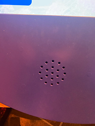
>Un haut-parleur qui permet aux visiteurs d'entendre ce que le personnage du dispositif dit.

[L'écran](#Les-poussins-disparus) est nécéssaire pour afficher les animations et les consignes du dispositif.

## Éléments nécessaires à la mise en exposition

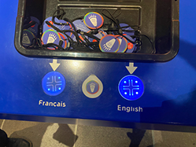
>À l'entrée de l'exposition, il est possible de choisir entre l'anglais et le français, ce qui rend l'exposition accessible à un plus grand public.

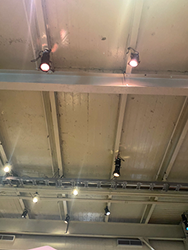
>Les lumières de la salle qui donne une bonne visibilité.

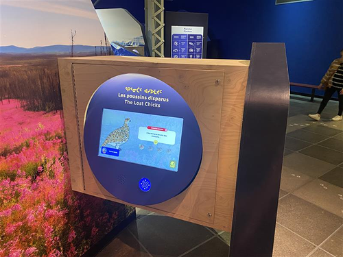  
>Le dispositif se trouve dans une sorte de boite en bois, qui permet de caché l'électronique, puisque l'exposition est familiale, il ne faut donc pas qu'il y ait des fils éléctroniques qui trainent dans la salle.

[Les murs](#Les-poussins-disparus) présents dans l'espace de l'exposition permettent de supporter les différents dispositifs et à créé une ambiance plus immersive. Ils permettent également d'afficher les éléments à récupérer (comme les poussins).

## Expérience vécue
aucuns fils dans le chemin

## Ce qui m'a plus
J'ai apprécié l'accessibilité de l'exposition. Les écrans et éléments à trouver se trouve à un hauteur qui permet même aux enfant d'intéragir avec, il est possible de choisir entre l'anglais et le français et les acteurs qui font la voix des personnages parlent lentement et clairement, ce qui rend la compréhension facile si le visiteur n'arrive pas à lire.

## Ce qui m'a moins plus
Parfois, les dialogues des personnages étaient très long et il n'était pas possible de passer à la prochaine étape alors que le texte avait été lu, il aurait donc été agréable de pouvoir  passé dès que tout le texte s'est affiché.

## Références
- [Site de l'exposition](https://www.centredessciencesdemontreal.com/exposition-permanente/nanualuk-expedition-nordique)
- [Oiseau](https://en.wikipedia.org/wiki/Sharp-tailed_grouse)
- Photos prises par Anne-Julie Labrie

