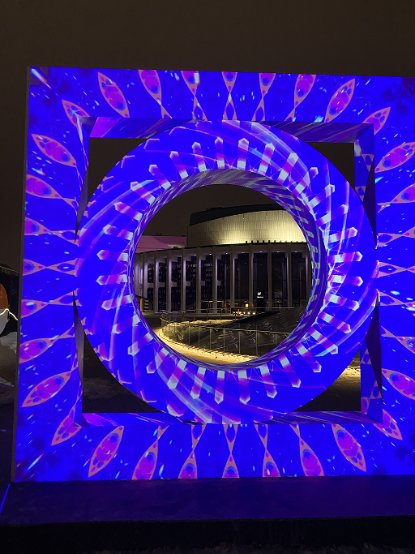

# Lumino

## Informations générales sur l'exposition
Il s'agit d'une exposition temporaire, intérieure et extérieure, présentée à la place des arts à Montréal et que j'ai visitée le 20 février 2026.  

> Affiche de l'exposition

## Stargate
### CHALK RIVER LABS, réalisée en 202

> Photos du oeuvre de nuit

> Photo du oeuvre de jour

[extrait_audio.mp3](https://github.com/user-attachments/files/25607587/extrait_audio.mp3)
> Extrait audio 

## Description du oeuvre

> Texte explicatif du oeuvre

## Type d'installation
Il s'agit d'une installation immersive  

> Vue d'ensemble du oeuvre

## Mise en espace

> Croquis du oeuvre vue de haut

> Croquis du oeuvre vue de face

## Composantes et techniques

> Les projecteurs et les enceintes

> La structure sur laquelle sont projetées des lumières

## Éléments nécessaires à la mise en exposition

> Le socle sur lequel repose le oeuvre

## Ce qui m'a plu
audio immersive, changements de couleurs intéressants, les projecteurs sont sur le côté donc on peut être en avant sans tout gâcher

## Ce qui m'a moins plu
Milieu décevant

## Références
1. Photos de l'oeuvre prisent par Anne-Julie Labrie
2. Photos du oeuvre de jour : https://www.instagram.com/p/CqOU8LxvbSQ/?img_index=1
3. Extrait audio : https://www.instagram.com/reels/audio/211889515341615/
4. Autres informations: https://www.luminomtl.com/en/activities/exterior-works/stargate et https://www.chalkriverlabs.art/portfolio-collections/my-portfolio/project-title-6  

