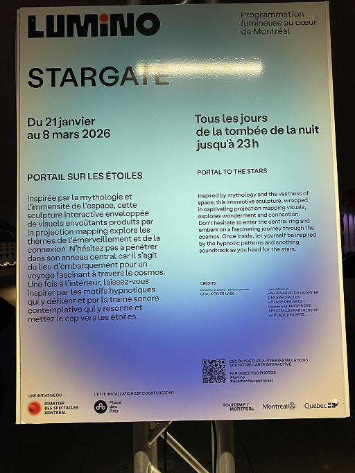

# Lumino

## Informations générales sur l'exposition
Il s'agit d'une exposition temporaire, intérieure et extérieure, présentée à la place des arts à Montréal et que j'ai visitée le 20 février 2026.

## Stargate
### CHALK RIVER LABS, réalisée en 202

## Description de l'oeuvre

## Type d'installation

## Fonction du dispositif

## Mise en espace

## Composantes et techniques

## Éléments nécessaires à la mise en exposition

## Ce qui m'a plu
audio immersive, changements de couleurs intéressants

## Ce qui m'a moins plu
Milieu décevant

## Références
Photos de l'oeuvre prisent par Anne-Julie Labrie
Photos du dispositif de jour : https://www.instagram.com/p/CqOU8LxvbSQ/?img_index=1
Extrait audio : https://www.instagram.com/reels/audio/211889515341615/
Autres informations: https://www.luminomtl.com/en/activities/exterior-works/stargate et https://www.chalkriverlabs.art/portfolio-collections/my-portfolio/project-title-6  

