# Lumino

## Informations générales sur l'exposition
Il s'agit d'une exposition temporaire, en extérieure, présentée à la place des arts à Montréal et que j'ai visitée le 20 février 2026. 

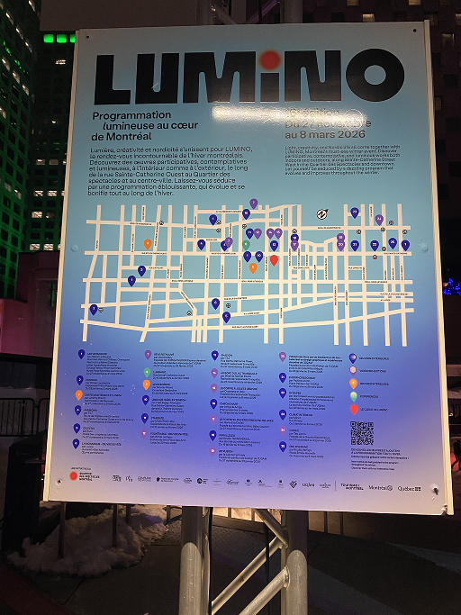
> Affiche de l'exposition  

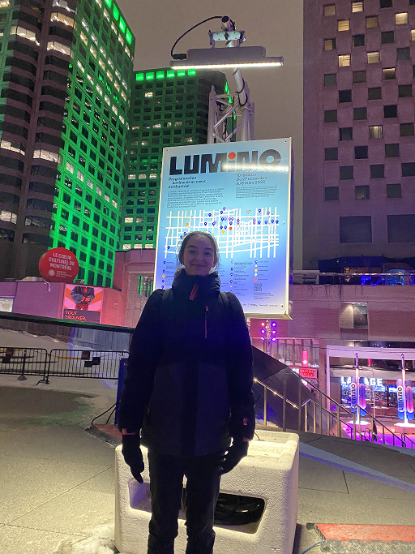
> Moi devant l'affiche de l'exposition
## Stargate
### CHALK RIVER LABS, réalisée en 2025
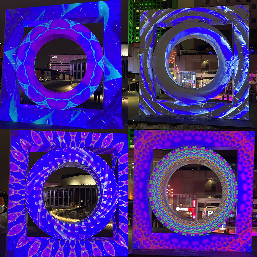
> Photos du oeuvre de nuit

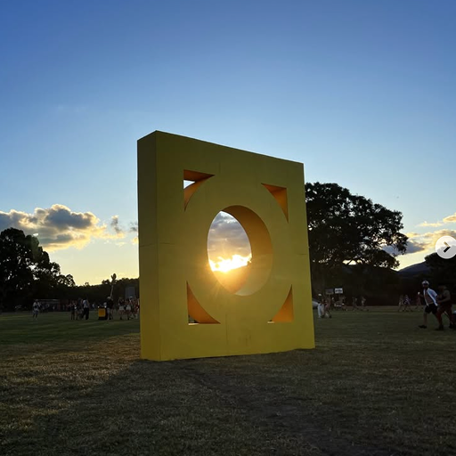
> Photo du oeuvre de jour

[extrait_audio.mp3](https://github.com/user-attachments/files/25607587/extrait_audio.mp3)
> Extrait de l'audio de l'oeuvre 
 
## Description de l'oeuvre
Il s'agit d'une structure d'environ 3-4 mètres de haut et de large sur laquelle sont projetés des lumières et motifs colorés. Il y a également un audio qui joue en boucle et qui donne vit à un univers fantastique qui rappel l'espace.

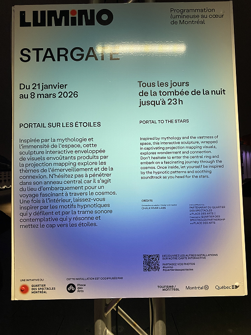
> Texte explicatif de l'oeuvre

## Type d'installation
Il s'agit d'une installation immersive  

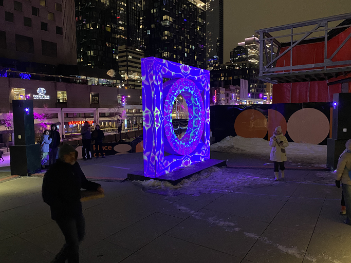
> Vue d'ensemble de l'oeuvre

## Mise en espace
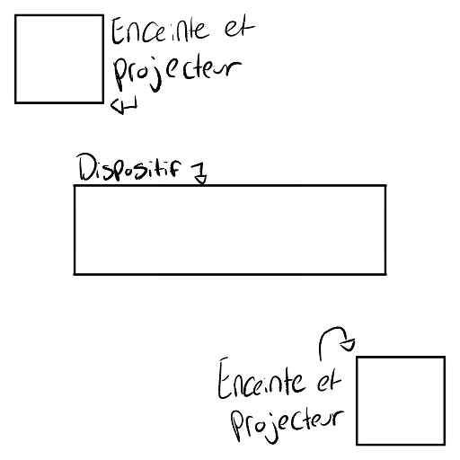
> Croquis de l'oeuvre vue de haut

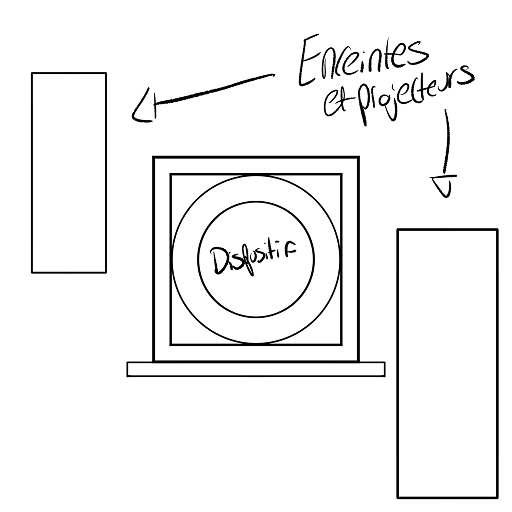
> Croquis de l'oeuvre vue de face

## Composantes et techniques
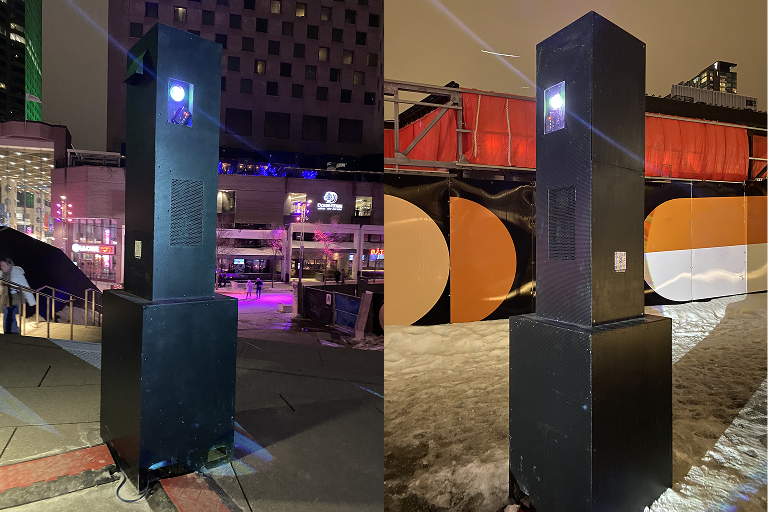
> Les projecteurs et les enceintes

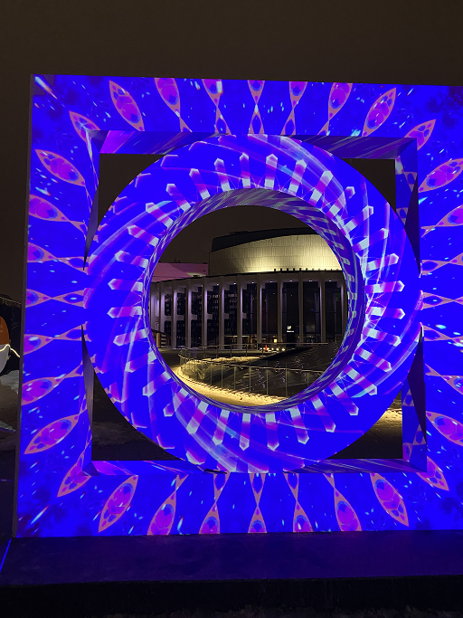
> La structure sur laquelle sont projetées les lumières

## Éléments nécessaires à la mise en exposition
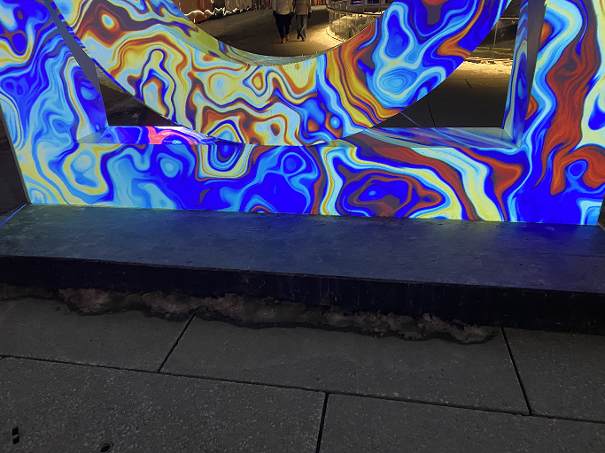
> Le socle sur lequel repose la structure de l'oeuvre

## Expérience vécue
Il faut tourner autour de l,oeuvre et se placer à différents endroits pour apprécier les différents angles de lumière et l'audio. Nous sommes également invité à s'assoir au milieu

## Ce qui m'a plu
audio immersive, changements de couleurs intéressants, les projecteurs sont sur le côté donc on peut être en avant sans tout gâcher

## Ce qui m'a moins plu
Milieu décevant

## Références
1. Photos de l'oeuvre prisent par Anne-Julie Labrie
2. Photos du oeuvre de jour : https://www.instagram.com/p/CqOU8LxvbSQ/?img_index=1
3. Extrait audio : https://www.instagram.com/reels/audio/211889515341615/
4. Autres informations: https://www.luminomtl.com/en/activities/exterior-works/stargate et https://www.chalkriverlabs.art/portfolio-collections/my-portfolio/project-title-6  

