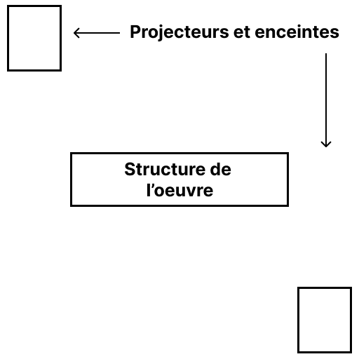
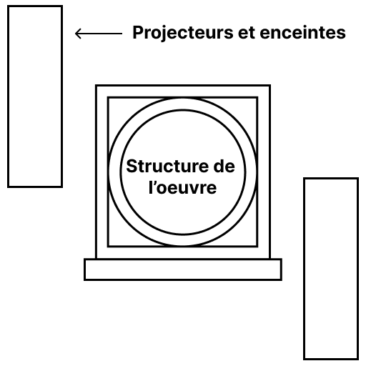

# Lumino

## Informations générales sur l'exposition
Il s'agit d'une exposition temporaire, en extérieur, présentée à la Place des arts à Montréal et que j'ai visitée le 20 février 2026. 

> Affiche de l'exposition  

> Moi devant l'affiche de l'exposition
> 
## Stargate

### CHALK RIVER LABS, réalisée en 2025

> Photos de l'œuvre de nuit

> Photo de l'œuvre de jour

[extrait_audio.mp3](https://github.com/user-attachments/files/25607587/extrait_audio.mp3)

> Extrait de l'audio de l'œuvre
 
## Description de l'œuvre

Il s'agit d'une structure d'environ 3-4 mètres de haut et de large sur laquelle sont projetés des lumières et motifs colorés, qui changent constamment. Il y a également un audio qui joue en boucle et qui donne vie à un univers fantastique qui rappelle l'espace.

> Texte explicatif de l'œuvre

## Type d'installation

Il s'agit d'une installation immersive.

> Vue d'ensemble de l'œuvre

## Mise en espace

> Croquis de l'œuvre vue de haut

> Croquis de l'œuvre vue de face

## Composantes et techniques

> Les projecteurs et les enceintes

> La structure sur laquelle sont projetées les lumières

## Éléments nécessaires à la mise en exposition

> Le socle sur lequel repose la structure de l'œuvre

## Expérience vécue

Afin de bien apprécier l'œuvre, il faut tourner autour de la structure, afin d'observer les projections de lumières sous différents angles et écouter l'audio sous différentes perspectives.

## Ce qui m'a plu

L'audio est très intéressant et aide beaucoup à l'immersion de l'univers fantastique qui est créé. Les changements de couleurs sont très beaux, les motifs captivants et hypnotisants, ils donnent envie d'observer l'œuvre pendant des heures. Un autre point positif est que la façon dont sont disposés les projecteurs permettent aux visiteurs d'observer l'œuvre, sans déranger les projecteurs, qui sont placés assez haut pour ne pas être cachés.

## Ce qui m'a moins plu

Nous sommes également invités à se rendre dans le milieu de la structure et de s'y asseoir pour une expérience encore plus immersive. Malheureusement, j'ai trouvé cela plutôt décevant, les visuels sont plus impressionnants du point de vue extérieur qu'intérieur. De l'intérieur, il s'agit simplement d'unne bande de lumière.

## Références
1. Photos de l'oeuvre prisent par Anne-Julie Labrie
2. Photos du oeuvre de jour : https://www.instagram.com/p/CqOU8LxvbSQ/?img_index=1
3. Extrait audio : https://www.instagram.com/reels/audio/211889515341615/
4. Autres informations: https://www.luminomtl.com/en/activities/exterior-works/stargate et https://www.chalkriverlabs.art/portfolio-collections/my-portfolio/project-title-6  

