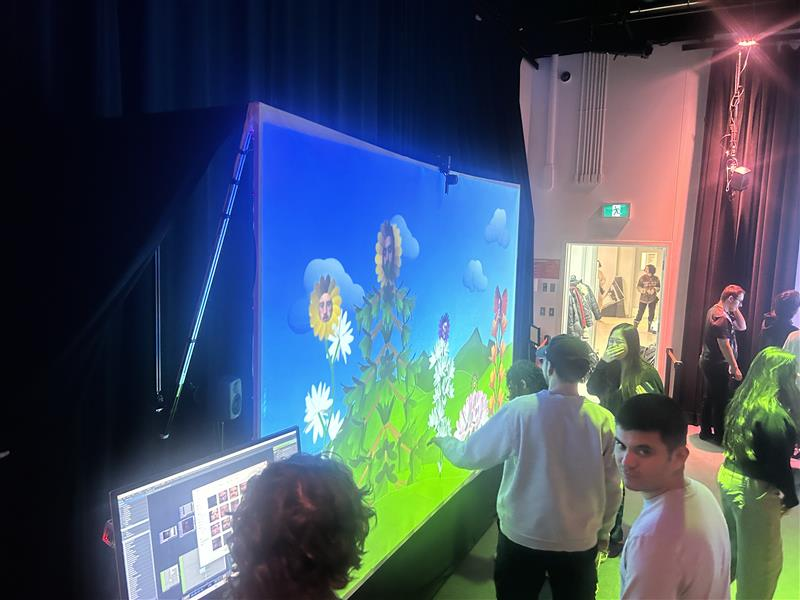
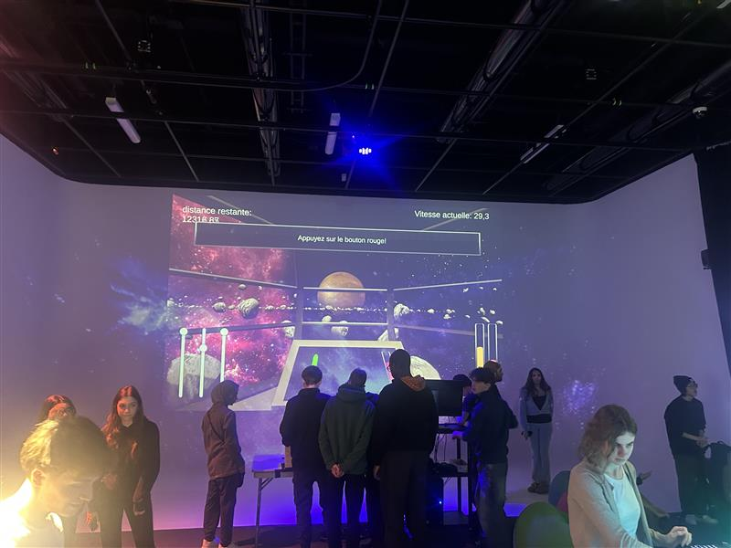
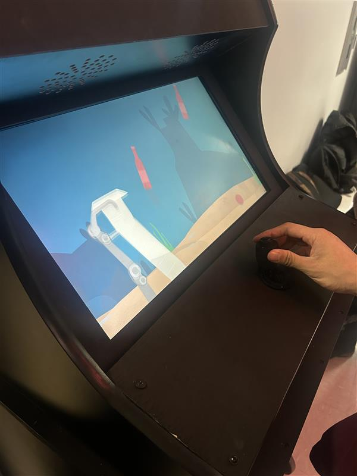
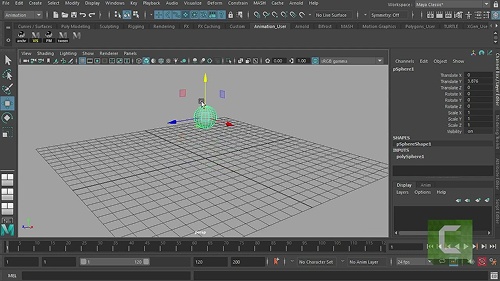

# Palmarès des dispostifs de l'exposition "Résau Vivant"

## 1. Terminal
### Projet réalisé par Émeryk Belisle, Elie Daher, Ting Yung Lu Terry, Dana Saavedra-Torrano et Mégane Ranger

>Vue d'ensemble du projet  
(photo prise par Rosa-Lee Savoie)

>Implatation 2D du projet
### Ressentis du projet
J'ai bien aimé l'esprit d'équipe que le jeu nous fait avoir, puisqu'il faut discuter avec les autres joueurs pour déterminer nos passages et ne pas heurter entre nous et récupérer les clés dans certains niveaux. Par contre, lors des essais que j'ai fait sur deux jours consécutifs, il y avait un niveau en particulier qui ne fonctionnait pas, ce qui coupait l'expérience brusquement et j'ai trouver cela dommage.

## 2. Arbre en Face
### Projet réalisé par Alexandre Gendron, Mikael Arseneau, Mathieu Willett, Matis Ghariani et Rafael Angon Dubé

>Vue d'ensemble du projet  
(photo prise par Rosa-Lee Savoie)

>Schéma 2D du projet
### Ressentis du projet
Captivant, amusant

## 3. Mission Décolage

### Projet réalisé par Ahmed Kaissoumi,Radhouane Kordan, Justin Montpetit, Thearylou Lach et Jad Saloumi

>Vue d'ensemble du projet  
(photo prise par Rosa-Lee Savoie)

>Implatation 2D du projet
### Ressentis du projet
Stress (bon stress), travail d'équipe, focus

## 4. Océan Rouge

### Projet réalisé par Amira Tounekti et Kristy Moussally

>Vue d'ensemble du projet  
(photo prise par Rosa-Lee Savoie)

>Schéma 2D du projet
### Ressentis du projet
Concept intéressant, visuels très beaux, mais redondant

## 5. Quand les yeux se croisent

### Projet réalisé par Edelwyn Ledru, Félix Lavoie, Jade Hébert, Manel Yaya et Patricia Nassif

>Vue d'ensemble du projet  
(photo prise par Rosa-Lee Savoie)

>Implatation 2D du projet
### Ressentis du projet
Visuelement beau, mais concept pas clair

## Reflexion du cheminement TIM
### 3 Cours incontournables pour la création de ce genre de projet
1. Interactivité ludique (Session 3)
2. Réalité mixte (Session 4)
3. Traitement audiovisuel (Session 4)

### Un logiciel qui est utilisé dans plusieurs projet et que je ne connaissais pas
#### Maya
Autodesk Maya, souvent simplement appelé "Maya", est un logiciel de modélisation, d'animation, de simulation et de rendu 3D. Utilisé par les professionnels de l'industrie du cinéma, de la télévision, des jeux vidéo et de la publicité, Maya est un outil puissant pour donner vie à des idées créatives.s

>Logo du logiciel

>Interface du logiciel

## Sources
#### Liens des projets: 
- [Terminal](https://pythons-5.github.io/Terminal/#/)
- [Océan Rouge](https://deux-intelligence.github.io/deux-neurones/#/)
- [Quand les yeux se croisent](https://emersiaa.github.io/Quand-les-yeux-se-croisent/#/)
- [Mission décollage](https://o-i-g-n-o-n.github.io/Mission-decollage/#/)
- [Arbre en Face](https://mammouths.github.io/projet/#/)
  
#### Autodesk Maya :
- https://github.com/Autodesk-Maya-Professional/
- https://www.clubic.com/telecharger-fiche431319-maya.html
