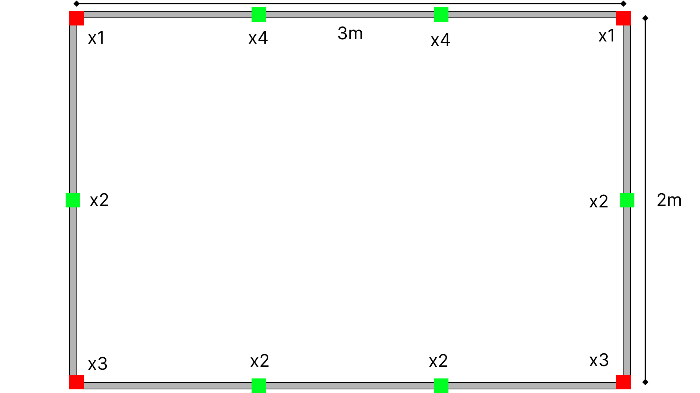
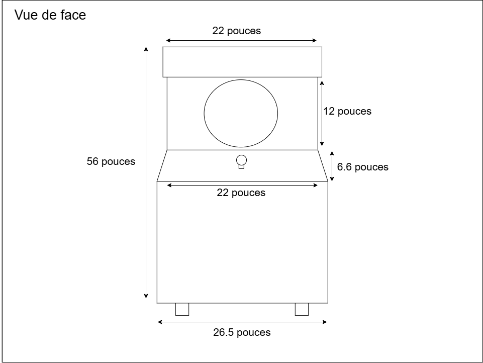

# Palmarès des dispostifs de l'exposition "Résau Vivant"

## 1. Terminal
### Projet réalisé par Émeryk Belisle, Elie Daher, Ting Yung Lu Terry, Dana Saavedra-Torrano et Mégane Ranger

>Vue d'ensemble du projet

>Implatation 2D du projet
### Ressentis du projet
Compétition et travail d'équipe, amusant, captivant, problèmes lors de l'essai

## 2. Arbre en Face
### Projet réalisé par Alexandre Gendron, Mikael Arseneau, Mathieu Willett, Matis Ghariani et Rafael Angon Dubé

>Vue d'ensemble du projet

>Schéma 2D du projet
### Ressentis du projet
Captivant, amusant

## 3. Mission Décolage

### Projet réalisé par Ahmed Kaissoumi,Radhouane Kordan, Justin Montpetit, Thearylou Lach et Jad Saloumi

>Vue d'ensemble du projet

>Implatation 2D du projet
### Ressentis du projet
Stress (bon stress), travail d'équipe, focus

## 4. Océan Rouge

### Projet réalisé par Amira Tounekti et Kristy Moussally

>Vue d'ensemble du projet

>Schéma 2D du projet
### Ressentis du projet
Concept intéressant, visuels très beaux, mais redondant

## 5. Quand les yeux se croisent

### Projet réalisé par Edelwyn Ledru, Félix Lavoie, Jade Hébert, Manel Yaya et Patricia Nassif

>Vue d'ensemble du projet

>Implatation 2D du projet
### Ressentis du projet
Visuelement beau, mais concept pas clair

## Reflexion du cheminement TIM
### 3 Cours incontournables pour la création de ce genre de projet
1. Interactivité ludique (Session 3)
2. Réalité mixte (Session 4)
3. Traitement audiovisuel (Session 4)

### Nommer et décrire une technique ou une composante technologique qui est utilisée dans l'un des projets et que vous ne connaissiez pas.

>Caption

Description

## Sources
Liens des projets: 
- https://pythons-5.github.io/Terminal/#/ (Terminal)
- https://deux-intelligence.github.io/deux-neurones/#/ (Océan Rouge)
- https://emersiaa.github.io/Quand-les-yeux-se-croisent/#/ (Quand les yeux se croisent)
- https://o-i-g-n-o-n.github.io/Mission-decollage/#/ (Mission décollage)
- https://mammouths.github.io/projet/#/ (Arbre en Face)  
Image de la composante truc truc :
