# Réseau Vivant
Il s'agit d'une exposition temporaire intérieure, présentée dans le studio TIM (collège Montmorency) que j'ai visitée le 24 février 2026 et le 17 mars 2026

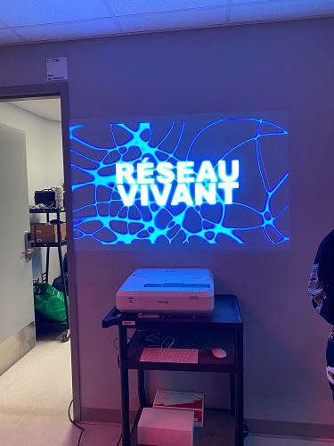
>Photo de l'affiche de l'exposition

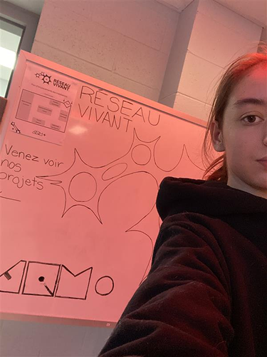
>Moi devant l'entrée de l'exposition

## Informations générales sur l'exposition

## Symbiose
### Yannick Chamberland, Benjamin Ferland, Ryan Dufault et Walid Cheour, projet réalisé en 2025-2026
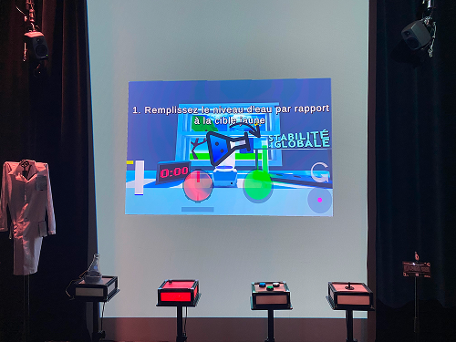
>Vue d'ensemble du dispositif

## Description du dispositif
Il s'agit d'un jeu, qui se joue en équipe de 2 à 4 personnes. Le but du jeu est de maintenir la potion fictive à une certaine stabilité, le plus longtemps possible. Il y a 4 rôles distincts: l'eau, la température, des boutons de couleurs et le mélange (voir la section [composantes et techniques](#composantes-et-techniques) pour plus de détails). Après un certain nombre d'erreurs le jeu se termine.

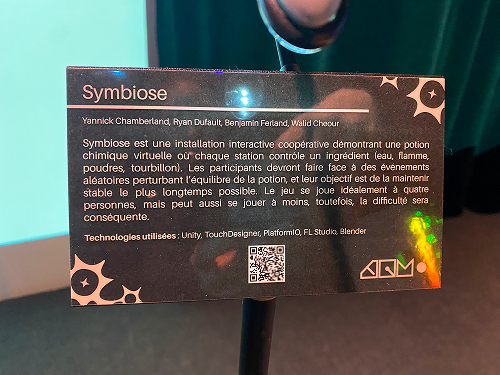
>Texte explicatif du dispositif

## Type d'installation
Il s'agit d'une installation qui est intéractive.

## Fonction du dispositif multimédia
La fonction de ce dispositif est la scénographie.

## Mise en espace
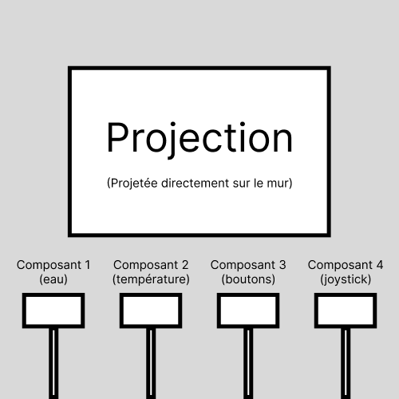
>Croquis du dispositif (vue de face). Il s'agit du premier dispositif à gauche lorsque l'on rentre dans le studio.

## Composantes et techniques
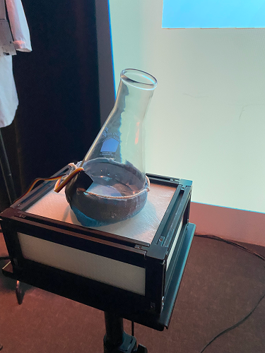
>Un erlrenmeyer avec un capteur de mouvement en dessus, en charge de la partie "eau" du jeu

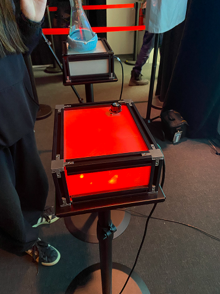
>Une roulette qui contrôle la température de la potion du jeu

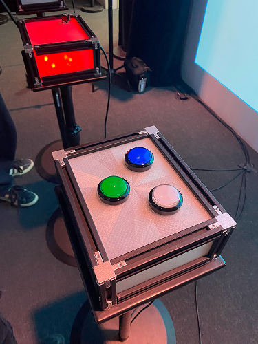
>Des boutons de 3 couleurs différentes, qui s'affichent à l'écran de façon aléatoire, le joueur doit cliquer rapidemment sur la bonne couleur

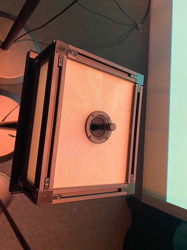
>Le "joystick" qui contrôle le mélange de la potion du jeu

## Éléments nécessaires à la mise en exposition
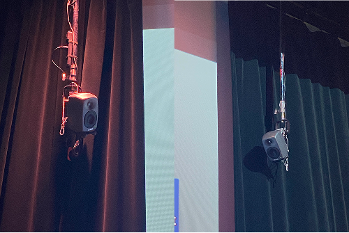
>Les hauts-parelurs permettent aux utilisateurs de se plongé dans l'univers du jeu avec les effets sonores.

>Un projecteur qui affiche le jeu sur le mur ([voir le croquis](#mise-en-espace))  
(photo prise par Thomas Bozelko)

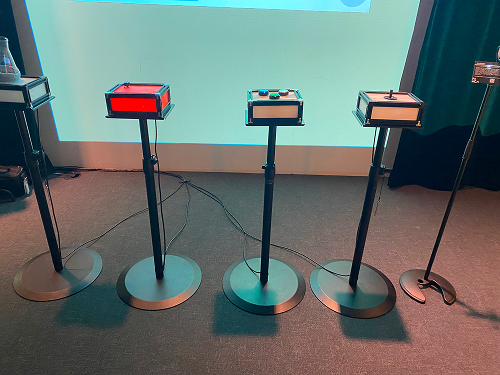
>Les socles qui permettent de soutenir les parties composantes du dispositif
## Expérience vécue
recommende 4 jours, joue à minimum 2, chacun se met devant un truc, le jeu commence, qte à accomplir
## Ce qui m'a plu

## Ce qui m'a moins plu
Globalement, j'ai très apprécié l'expérience de ce dispositif, mais un élément qui aurait ou être amélioré est l'affichage des consignes. En effet, les consignes des événements étaient inscrites dans le haut de l'image, mais la projection elle-même était projetée plutôt haute sur le mur, ce qui rendait les instructions difficile à repérées, surtout en étant concentré sur le jeu.

## Références
Lien du projet : https://les-chimistes.github.io/symbiose/#/
