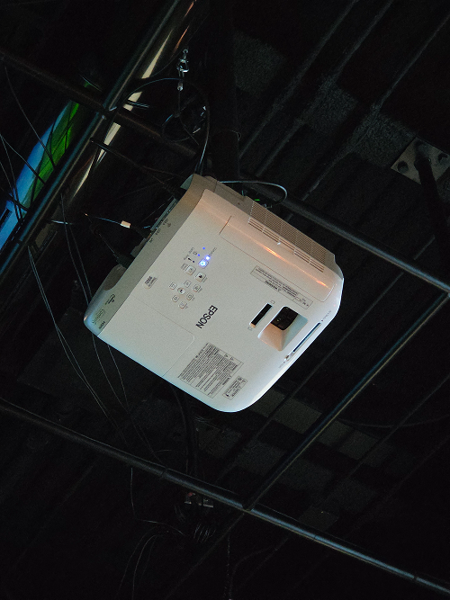

# Réseau Vivant
Il s'agit d'une exposition temporaire intérieure, présentée dans le studio TIM (collège Montmorency) que j'ai visitée le 24 février 2026 et le 17 mars 2026

>Photo de l'affiche de l'exposition

>Moi devant l'entrée de l'exposition

## Informations générales sur l'exposition

## Symbiose
### Yannick Chamberland, Benjamin Ferland, Ryan Dufault et Walid Cheour, projet réalisé en 2025-2026

>Vue d'ensemble du dispositif

## Description de l'œuvre

>Texte explicatif du dispositif

## Type d'installation

## Fonction du dispositif multimédia

## Mise en espace

## Composantes et techniques

>Description

>Description

>Description

>Description

## Éléments nécessaires à la mise en exposition

## Expérience vécue

## Ce qui m'a plu

## Ce qui m'a moins plu

## Références
Lien du projet : https://les-chimistes.github.io/symbiose/#/
